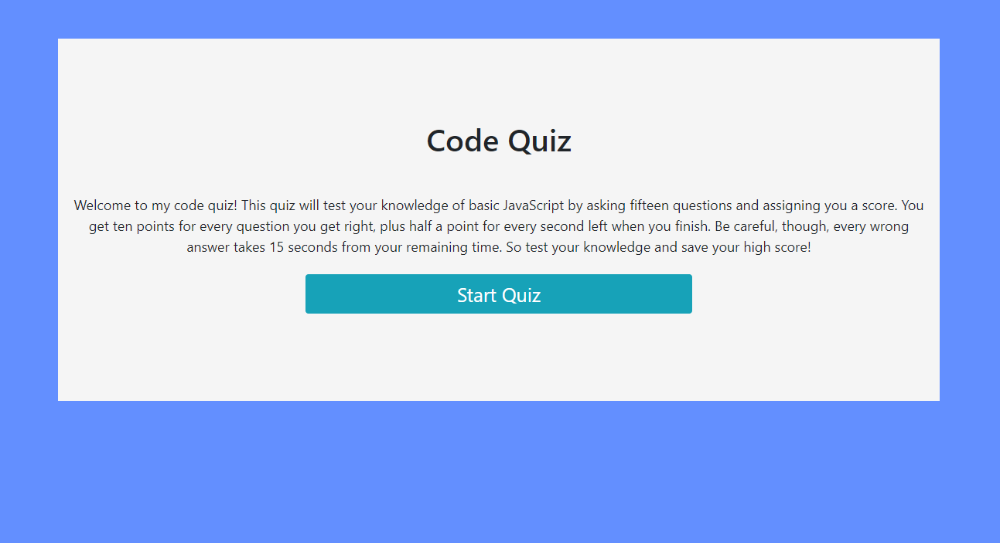
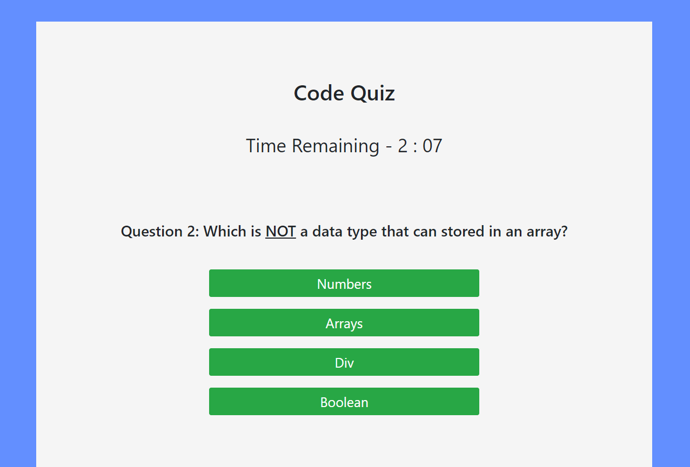
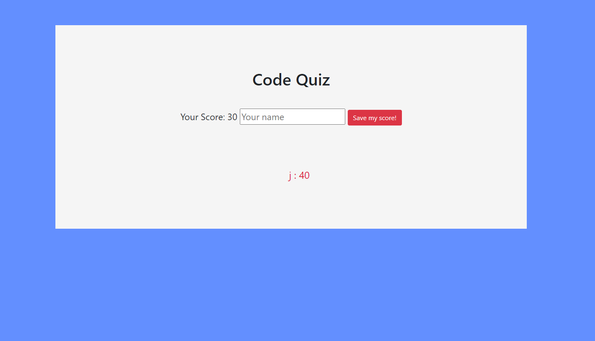

# code-quiz
Code Quiz

Description

This is a short and simple code quix that allows a user to save their scores over time. 

The project uses vanilla JavaScript to run and a combination of bootstrap and custom CSS for styling. 

All the questions are in the html file, and the display changes whenever a question is answered to hide the current question and show the next question. This is done using a function I've made that uses the IDs of each question div to display the next question. When the user answers the last question or the timer reaches zero, the quiz ends and the score is displayed. The user can then save their score, and it displays with previous saved scores thet persist.

Links

Deployed app: https://jjbidwell.github.io/code-quiz/

Github repository: https://github.com/jjbidwell/code-quiz

Screenshots: 

